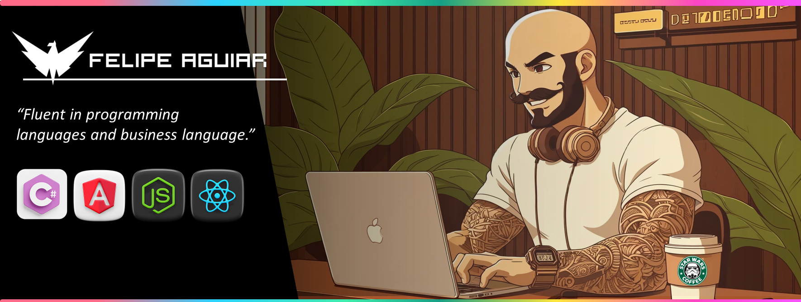
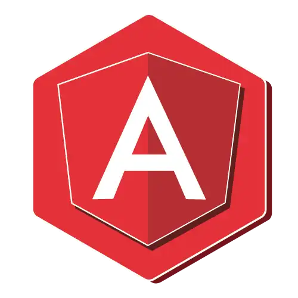

<!--  -->
  

<h3 align="center">
  FullStack Developer • Tech Instructor • Youtuber
</h3>

  
  
   
  
  
  

 

## &nbsp;My Stack

## About me

-  Hello! My name is Felipe Aguiar and I am a FullStack Developer and Graduate in computer science..  
-  My current goal is become a Software Architect. 
-  My main stack is .net C# with Angular and NodeJs with React. 
-  I always try to be a polite and respectful person, and I love interacting with new people and sharing my story. 
-  I'm a Tech Instructor at @DIO_MAKETHECHANGE platform.

## 🎬 &nbsp;My Last Youtube Videos

<!-- YT LIST START -->

&nbsp;&nbsp;
**[▶️ Estrutura de Pastas Para Projetos Front-end (Nível Pro) - #frontendraíz!](https://www.youtube.com/watch?v=rkgVtUe3PL4)**
  &nbsp;&nbsp;&nbsp;1 semana atrás

&nbsp;&nbsp;
**[▶️ COMO INSTALAR O DOTNET | C# DO JEITO MODERNO! ](https://www.youtube.com/watch?v=jcPpJ2tRe2g)**
  &nbsp;&nbsp;&nbsp;2 Semanas atrás

<!-- YT LIST END -->

Mais vídeos do Felipão? [Veja meu Canal do Youtube.](https://www.youtube.com/@devaguia)

## 📌 &nbsp;Pinned Repositories

<table>
	<thead>
		<tr>
			<th colspan="2" width="2000">&nbsp;</th>
		</tr>
	</thead>
	<tbody>
		<tr>
			<td align="center" valign="top" width="80"> 
			
      </td>
			<td valign="top">
			<h3>Angular Playground</h3>
			
Exemplos práticos das principais competências de Angular.

			
			</td>
		</tr>
		<tr>
			<td align="center" valign="top" width="80"> 
			
      </td>
			<td valign="top">
			<h3>Angular Blog</h3>
			
An Simple blog with Angular, good pratices for folder structure.

			</td>
		</tr>
	</tbody>
</table>

<h3>Contact Me</h3>

  
Credits
 
  - GitHub Stats by <a href="https://github.com/anuraghazra/github-readme-stats">anuraghazra</a>
   
   - GitHub Streak by <a href="https://github.com/DenverCoder1/github-readme-streak-stats">DenverCoder1</a>
   
  - Developer vector created by <a href="https://www.freepik.com/vectors/developer">storyset - www.freepik.com</a> (edited by author)

