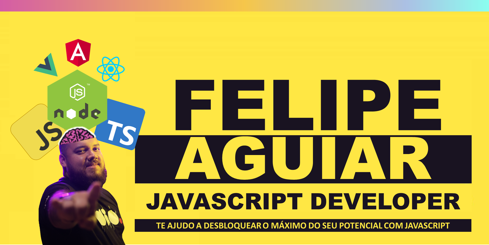

<h1 align="center">
  Hello World 👋
</h1>

   <!--  -->
   

<h3 align="center">
  FullStack Developer • Tech Instructor • Youtuber
</h3>

***

### 🎯 Fluent in programming languages and business language

Hey there 👋

I’m Felipe, a full-stack engineer, creative coder and 🎓graduated in Computer Science. I made it my mission my passion for education and changing people's lives through programming, I specialize in Dotnet and Javascript solutions.

Want to know more about me? [Check out my Youtube.](https://www.youtube.com/channel/UCCcDZkI7AITYFCgDEFV9OoQ)

***
## 🛠 &nbsp;Tech Stack

### 👩‍💻 &nbsp;Back-End

&nbsp;
&nbsp;
&nbsp;
&nbsp;

### 🎨 &nbsp;Front-end
&nbsp;
&nbsp;
&nbsp;
&nbsp;

### ⚡ &nbsp;Database 
&nbsp;
&nbsp;
&nbsp;

## 📌 &nbsp;Pinned Repositories

<table>
	<thead>
		<tr>
			<th colspan="2" width="2000">&nbsp;</th>
		</tr>
	</thead>
	<tbody>
		<tr>
			<td align="center" valign="top" width="80"> 
			
      </td>
			<td valign="top">
			<h3>ChatGPT Clone (Node + React)</h3>
			
A Node integration with OpenAI algorithm and front-end with React

			</td>
		</tr>
		<tr>
			<td align="center" valign="top" width="80"> 
			
      </td>
			<td valign="top">
			<h3>Angular Blog</h3>
			
An Simple blog with Angular, good pratices for folder structure.

			</td>
		</tr>
	</tbody>
</table>

## 📊 &nbsp;Stats

<h3 align="left">GitHub Stats</h3>

	
	
	<!--  -->

  
Credits
 
  - Badges by <a href="https://shields.io/">shields.io</a>
   
  - GitHub Stats by <a href="https://github.com/anuraghazra/github-readme-stats">anuraghazra</a>
   
   - GitHub Streak by <a href="https://github.com/DenverCoder1/github-readme-streak-stats">DenverCoder1</a>
   
  - Developer vector created by <a href="https://www.freepik.com/vectors/developer">storyset - www.freepik.com</a> (edited by author)

